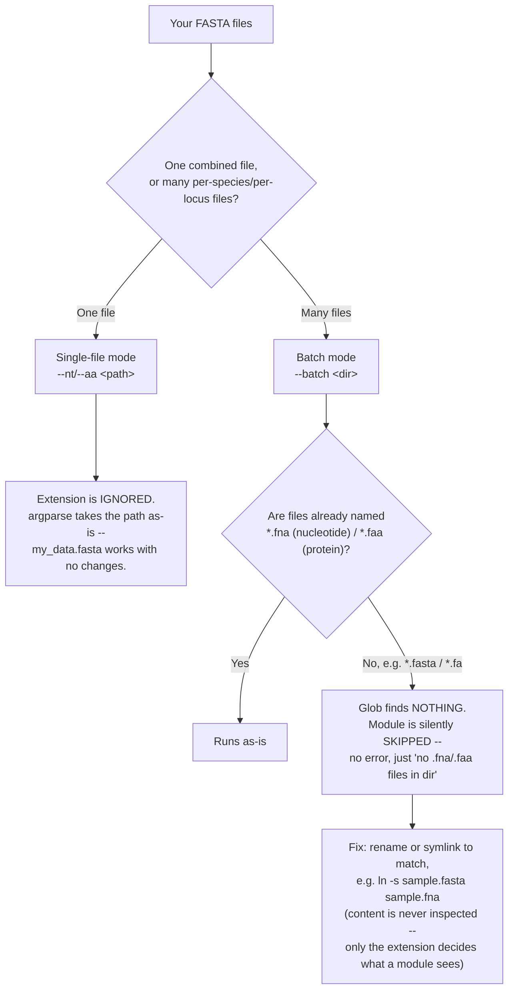

# SeqMetrics

Modular sequence-feature computation, given a CDS FASTA and its
corresponding protein FASTA. Pick the modules you need; nobody has to
install everything.

## Why this exists

Chapter 3's Stage 5 needs the same seven-plus feature panel (IUPred3,
HCA+TANGO, PEPSTATS, codonW, CTTH, CPAT, ...) that already exists,
built and debugged, in the Casola Lab's MLA-chapter project
(`2026fall-mla-chapter/pipeline/`). Reinventing those wrappers would mean
re-deriving real bugs that project already found and fixed (a silent
header-matching bug in HCA/TANGO, a mislabeled column in PEPSTATS, a
log-base bug in Kozak, an inconsistent gene-length definition across
species). This pulls the reusable wrapper *code* out into its own
standalone, shareable pipeline -- not a reference to that other project,
a real standalone thing -- organized by module so a user only sets up
what they actually want to run.

## Input contract

Every module takes one of:
- a **protein FASTA** (`.faa`) -- disorder, aggregation, composition,
  tail_hydrophobicity
- a **nucleotide/CDS FASTA** (`.fna`) -- basic (GC%), codon_usage,
  coding_potential

That's the whole contract: plain, uniquely-headered FASTA in. SeqMetrics
does not care how you organized your data before that point -- one file
per species (the convention an earlier lab project used), one file per
locus, one giant pooled file, doesn't matter. Getting your own data into
a FASTA with sane, unique headers is your project's own adapter step, not
SeqMetrics' job -- deliberately kept out of this tool. (This project's own
adapter, `stage5_build_inputs.py`, lives in `dng_feature_pipeline/codes/`
in the Chapter 3 project, not here -- it rewrites Stage 3/4's per-locus
files, which repeat headers like `role|node` across thousands of loci,
into a globally-unique composite key `gene_id::role::node` per trim type.)

Two ways to run modules against that FASTA -- see Usage below:
- **single-file mode**: one nucleotide and/or one protein FASTA, one
  output table per module.
- **batch mode**: a directory of FASTA files (any grouping you want --
  per species, per locus, whatever produced them), one output table per
  (module, file). Nucleotide modules only look at `*.fna` in that
  directory, protein modules only at `*.faa` -- one directory can hold
  both kinds at once without conflict.

The two modes treat file extensions completely differently -- confirmed
directly against the code, not assumed, since this has been a real source
of confusion:



No species name, filename convention, or file content is ever inspected
to decide "nucleotide vs. protein" -- purely the literal `.fna`/`.faa`
suffix, checked only in batch mode.

Illustrated versions of this same file-matching logic, and of how a module
invocation resolves to an actual command (`docs/assets/seqmetrics_overview.html`),
are in [`docs/assets/`](docs/assets/) if the flowchart above isn't enough on
its own.

## Modules

All eight modules below are wired and tested against real data.

| Module | Tool | Input | External dependency | Redistributable? | Install doc |
|---|---|---|---|---|---|
| `basic` | -- (pure Python) | nucleotide | none | yes | [install_basic.md](docs/install_basic.md) |
| `tail_hydrophobicity` | CTTH | protein | none | yes | [install_tail_hydrophobicity.md](docs/install_tail_hydrophobicity.md) |
| `composition` | EMBOSS PEPSTATS | protein | `pepstats` binary | EMBOSS is open-source (GPL) -- installable, not bundled | [install_composition.md](docs/install_composition.md) |
| `aggregation` | HCA + TANGO | protein | `hcatk` + `tango` binary | pyHCA is MIT-licensed; **TANGO is proprietary/academic-license** and must be obtained directly from its authors, never bundled | [install_aggregation.md](docs/install_aggregation.md) |
| `disorder` | IUPred3 + ANCHOR2 | protein | `iupred3_lib.py` | **IUPred3 is academic-license** -- must be obtained via registration at the authors' site, never bundled | [install_disorder.md](docs/install_disorder.md) |
| `codon_usage` | codonW | nucleotide | `codonw` binary + a pre-built per-species reference (`--module-ref`) | codonW is open-source and free -- installable, not bundled. Reference-building (Stage 1) is a separate upstream step | [install_codon_usage.md](docs/install_codon_usage.md) |
| `coding_potential` | CPAT | nucleotide | `CPAT` (pip) + a pre-built per-species reference (`--module-ref`) | CPAT is open-source (pip-installable). Reference-building (Stage 1: `make_hexamer_tab`+`make_logitModel`) is a separate upstream step | [install_coding_potential.md](docs/install_coding_potential.md) |
| `tm_domain` | DeepTMHMM2 | protein | isolated Python venv (not conda) | The official DTU DeepTMHMM requires registration for local use; this uses `fteufel/DeepTMHMM2`, an ungated reimplementation | [install_tm_domain.md](docs/install_tm_domain.md) |
| `localization` | LOCALIZER | protein | `pepstats`+`perl`+`java` + the LOCALIZER script itself (`--module-ref`) | GPL-3.0, plant-specific -- must be installed from its own GitHub repo, never bundled | [install_localization.md](docs/install_localization.md) |

Known gaps, not silently skipped: a **general-organism** localization
tool (TargetP or similar, for non-plant use -- LOCALIZER is plant-only).
**SSRs in CDS**, **protein domains** (Pfam/HMMER), and **gene overlap**
are known feature categories from the source project's historical output
that also have no wrapper yet.

**Real, unresolved methodological risks, tracked here rather than glossed
over:**
- `codon_usage`/`coding_potential` need genuinely per-species input files
  -- a pooled, multi-species FASTA needs to be split by species first
  (using whatever ID/species mapping your own upstream pipeline already
  has); neither module does this splitting itself.
- `calculate_indices.sh --basis-mode auto` silently falls back to the
  statistical top-5%-Fop method when no HEG file exists for a species --
  confirmed by direct test to produce numbers that are not just noisier
  but *negatively correlated* with the biologically-grounded HEG methods.
  A species with no working HEG file (whether from a real GFF3 annotation
  gap, a keyword-matching miss, or simply not having run
  `extract_heg_ids_hmm.py` for it yet) will silently get the unreliable
  fallback under `auto` mode rather than an error -- use `--basis-mode
  heg` instead if you want a hard failure when no HEG file is found,
  rather than a silent, less-trustworthy substitution.

Project-specific findings from applying SeqMetrics to a real dataset
(e.g. a particular species' reference status, a particular annotation
mismatch) belong in that project's own tracking, not here -- this repo
stays about the tool, not any one dataset it's been run against.

Only set up the modules you're actually going to run -- each install doc
is self-contained.

## Usage

Single-file mode (one FASTA in, one table out per module):
```
python run_features.py --modules basic,tail_hydrophobicity \
    --nt combined.fna --aa combined.faa --out-dir outputs/
# -> outputs/basic.tsv, outputs/tail_hydrophobicity.tsv
```

Batch mode (a directory of FASTA files -- e.g. one per species, or
whatever grouping your project already produces):
```
python run_features.py --modules basic,tail_hydrophobicity \
    --batch species_fastas/ --out-dir outputs/
# -> outputs/basic/<file_stem>.tsv, outputs/tail_hydrophobicity/<file_stem>.tsv
#    one output file per (module, input file)
```

`--modules` is comma-separated; only the environments those specific
modules need are checked before running. `--batch` and `--nt`/`--aa` are
mutually exclusive -- pick one mode per invocation. See
`run_features.py --help` for the full flag list.

### Concurrency: `--jobs N`

```
python run_features.py --modules composition,aggregation \
    --batch species_fastas/ --out-dir outputs/ --jobs 8
```

Runs up to `N` `(module, file)` task pairs at once via a thread pool --
covers both many species files under one module, and several modules on
one single-file input. Default `1` (fully sequential). Each task already
writes to its own scratch dir and output path, so this is safe to raise;
the real constraint is WSL headroom, since a WSL-bridged module spawns
one `wsl.exe`/conda session per task -- don't set this arbitrarily high
on a machine with limited WSL capacity. One failed task no longer aborts
the rest of the batch, but the process still exits `1` if anything failed.

### Audit log

Every invocation writes a plain-text log to
`<out_dir>/logs/run_<timestamp>.log` (extension is `.log`, e.g.
`outputs/logs/run_20260921_005146.log`) -- the exact command line, each
resolved module's environment and a best-effort tool version, every
`--module-ref` path actually used, and a result line per `(module, file)`
task. Not a second, structured format -- plain timestamped lines, matching
every wrapper script's own logging style already in this repo.

### aa-input sanitization: stop codons and zero-length sequences

Before dispatch, every protein-input module's `.faa` source is passed
through two real, confirmed fixes -- into a cached copy under
`<out_dir>/_filtered_aa/`, logged both to stderr and the audit log above.
Nucleotide-input modules are unaffected.

**A trailing stop-codon `*` is stripped from every sequence.** Confirmed
live, not hypothetical: running the real tracked locus AT5G15843.1's
un-stripped form through this orchestrator produced two different failure
modes in one session -- `tm_domain` hard-crashed (ESM's tokenizer has no
mapping for `*`), while `disorder` did NOT crash, it silently scored the
sequence *with* the `*` included as a real residue, corrupting every
length- and composition-dependent value in that row with no error at all.
Silent corruption is worse than a crash. Stripped centrally here, once,
rather than trusting five different wrapped tools (IUPred3, pyHCA, TANGO,
PEPSTATS, DeepTMHMM, LOCALIZER) to each handle it correctly on their own --
confirmed at least one doesn't.

**Zero-length records are filtered out** (a real case, not hypothetical: a
premature-stop translation landing at amino acid 0 -- confirmed at 2.6%
and 0.5% rates in two real trims of one project's own upstream data; this
check runs *after* stop-stripping, so a sequence that was only a bare stop
codon is correctly caught here too) -- an empty sequence handed to an
external tool risks a hard crash or a degenerate score, not a clean skip,
so this is enforced uniformly rather than trusting each wrapped tool's own
behavior on empty input.
