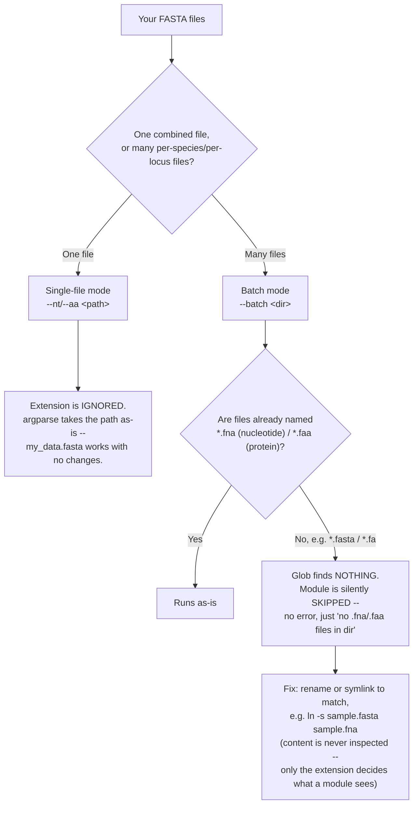

# SeqMetrics

Modular sequence-feature computation, given a CDS FASTA and/or its
corresponding protein FASTA. Pick the modules you need; nobody has to
install everything.

## Input contract

Every module takes one of:
- a **protein FASTA** (`.faa`) — disorder, aggregation, composition,
  tail_hydrophobicity
- a **nucleotide/CDS FASTA** (`.fna`) — basic (GC%), codon_usage,
  coding_potential

That's the whole contract: plain, uniquely-headered FASTA in.
SeqMetrics does not inspect how you organized your data before that
point — one file per species, one file per locus, one pooled file,
all work. Getting your own data into a FASTA with unique headers is
your own upstream step, not SeqMetrics' job.

Two ways to run modules — see Usage below:
- **single-file mode**: one nucleotide and/or one protein FASTA, one
  output table per module.
- **batch mode**: a directory of FASTA files, one output table per
  (module, file). Nucleotide modules look for `*.fna` in that
  directory, protein modules for `*.faa` — one directory can hold
  both at once.



No species name, filename convention, or file content is inspected to
decide nucleotide vs. protein — only the literal `.fna`/`.faa` suffix,
checked in batch mode.

Illustrated versions of this file-matching logic and the overall
architecture are in [`docs/assets/`](docs/assets/).

## Modules

| Module | Tool | Input | External dependency | License note | Install doc |
|---|---|---|---|---|---|
| `basic` | — (pure Python) | nucleotide | none | — | [install_basic.md](docs/install_basic.md) |
| `tail_hydrophobicity` | CTTH | protein | none | — | [install_tail_hydrophobicity.md](docs/install_tail_hydrophobicity.md) |
| `composition` | EMBOSS PEPSTATS | protein | `pepstats` binary | open-source (GPL) | [install_composition.md](docs/install_composition.md) |
| `aggregation` | HCA + TANGO | protein | `hcatk` + `tango` binary | pyHCA is MIT-licensed; **TANGO is academic-license**, obtain directly from its authors | [install_aggregation.md](docs/install_aggregation.md) |
| `disorder` | IUPred3 + ANCHOR2 | protein | `iupred3_lib.py` | **academic-license**, obtain via registration | [install_disorder.md](docs/install_disorder.md) |
| `codon_usage` | codonW | nucleotide | `codonw` binary + a pre-built per-species reference (`--module-ref`) | open-source and free; reference-building is a separate upstream step | [install_codon_usage.md](docs/install_codon_usage.md) |
| `coding_potential` | CPAT | nucleotide | `CPAT` (pip) + a pre-built per-species reference (`--module-ref`) | open-source; reference-building is a separate upstream step | [install_coding_potential.md](docs/install_coding_potential.md) |
| `tm_domain` | DeepTMHMM2 | protein | isolated Python venv (not conda) | official DeepTMHMM requires registration; this uses `fteufel/DeepTMHMM2`, an ungated reimplementation | [install_tm_domain.md](docs/install_tm_domain.md) |
| `localization` | LOCALIZER | protein | `pepstats`+`perl`+`java` + the LOCALIZER script (`--module-ref`) | GPL-3.0, plant-specific, must be installed from its own repo | [install_localization.md](docs/install_localization.md) |

Not yet built: a general-organism localization tool (LOCALIZER is
plant-only), SSR-in-CDS, protein-domain (Pfam/HMMER), and gene-overlap
features.

**Known methodological risks:**
- `codon_usage`/`coding_potential` need genuinely per-species input
  files — a pooled, multi-species FASTA must be split by species
  first; neither module does this splitting itself.
- `calculate_indices.sh --basis-mode auto` falls back to the
  statistical top-5%-Fop method when no HEG file exists for a species,
  silently — this produces results that are not just noisier but
  negatively correlated with the biologically-grounded HEG methods.
  Use `--basis-mode heg` for a hard failure instead of a silent,
  less-trustworthy substitution.

Only set up the modules you're actually going to run — each install
doc is self-contained.

## Usage

Single-file mode (one FASTA in, one table out per module):
```
python run_features.py --modules basic,tail_hydrophobicity \
    --nt combined.fna --aa combined.faa --out-dir outputs/
# -> outputs/basic.tsv, outputs/tail_hydrophobicity.tsv
```

Batch mode (a directory of FASTA files):
```
python run_features.py --modules basic,tail_hydrophobicity \
    --batch species_fastas/ --out-dir outputs/
# -> outputs/basic/<file_stem>.tsv, outputs/tail_hydrophobicity/<file_stem>.tsv
```

`--modules` is comma-separated; only the environments those specific
modules need are checked. `--batch` and `--nt`/`--aa` are mutually
exclusive. See `run_features.py --help` for the full flag list.

### Concurrency: `--jobs N`

```
python run_features.py --modules composition,aggregation \
    --batch species_fastas/ --out-dir outputs/ --jobs 8
```

Runs up to `N` `(module, file)` task pairs concurrently via a thread
pool. Default `1` (sequential). A WSL-bridged module spawns one
`wsl.exe`/conda session per task — keep this within your machine's WSL
headroom. One failed task does not abort the rest of the batch, but
the process still exits `1` if anything failed.

### Audit log

Every invocation writes a plain-text log to
`<out_dir>/logs/run_<timestamp>.log` — the command line, each
resolved module's environment and tool version, every `--module-ref`
path used, and a result line per `(module, file)` task.

### aa-input sanitization

Before dispatch, every protein-input module's `.faa` source is passed
through two checks, into a cached copy under `<out_dir>/_filtered_aa/`,
logged both to stderr and the audit log. Nucleotide-input modules are
unaffected.

- **Trailing stop-codon `*` characters are stripped.** Left unstripped,
  this produces two different failure modes depending on the tool:
  `tm_domain` crashes outright (ESM's tokenizer has no mapping for
  `*`); `disorder` does not crash, but silently scores the sequence
  with the `*` included as a real residue, corrupting every length-
  and composition-dependent value with no error. Stripped centrally
  here rather than relying on each of the five affected tools (IUPred3,
  pyHCA, TANGO, PEPSTATS, DeepTMHMM, LOCALIZER) to handle it correctly.
- **Zero-length records are filtered out** (runs after stop-stripping,
  so a sequence that was only a bare stop codon is caught too) — an
  empty sequence handed to an external tool risks a crash or a
  degenerate score rather than a clean skip.
